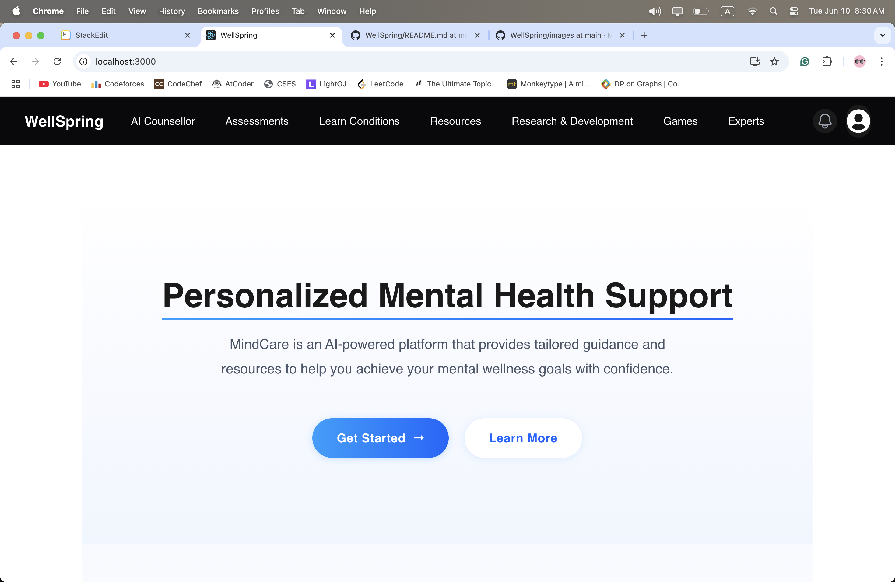
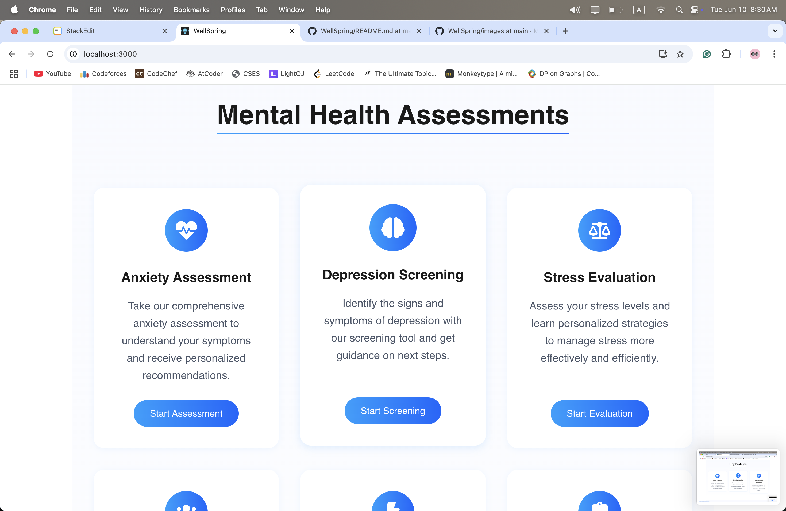
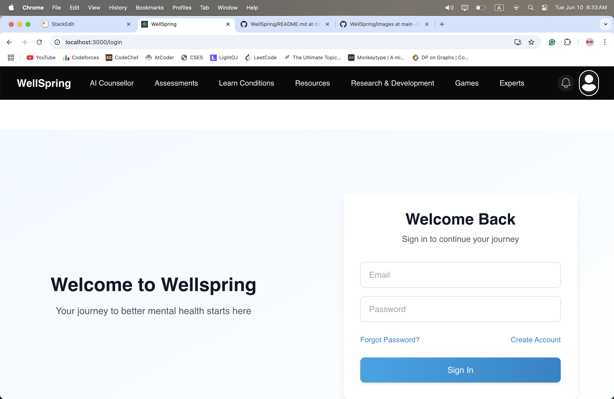
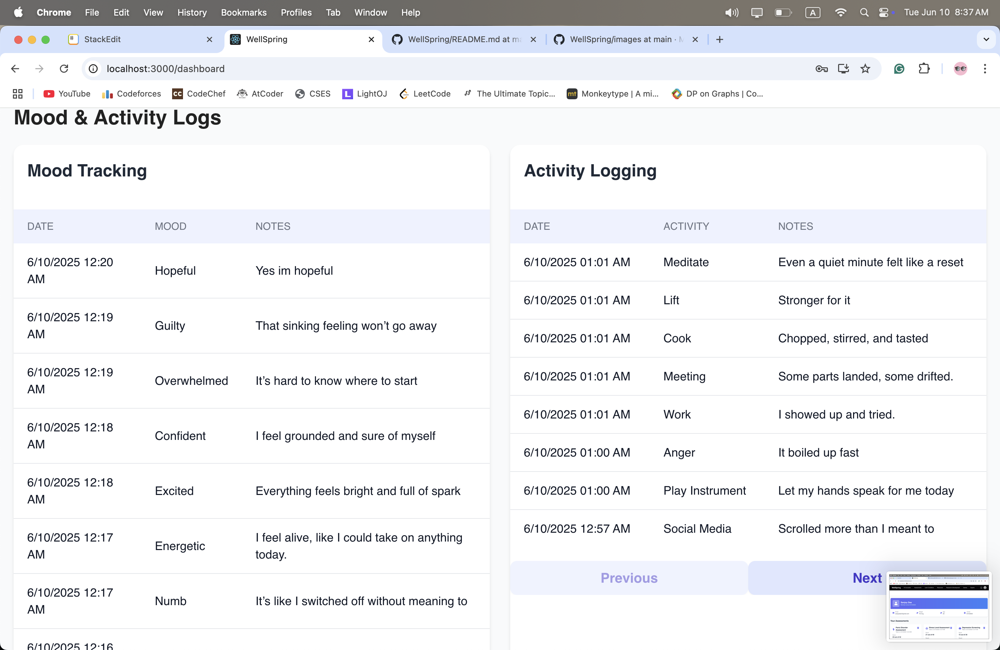
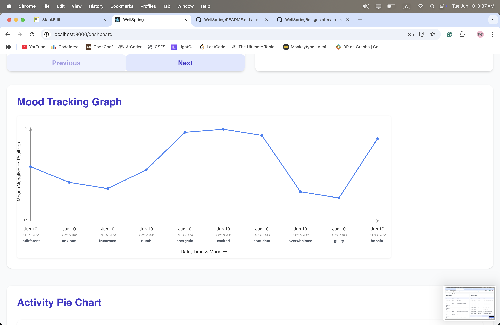
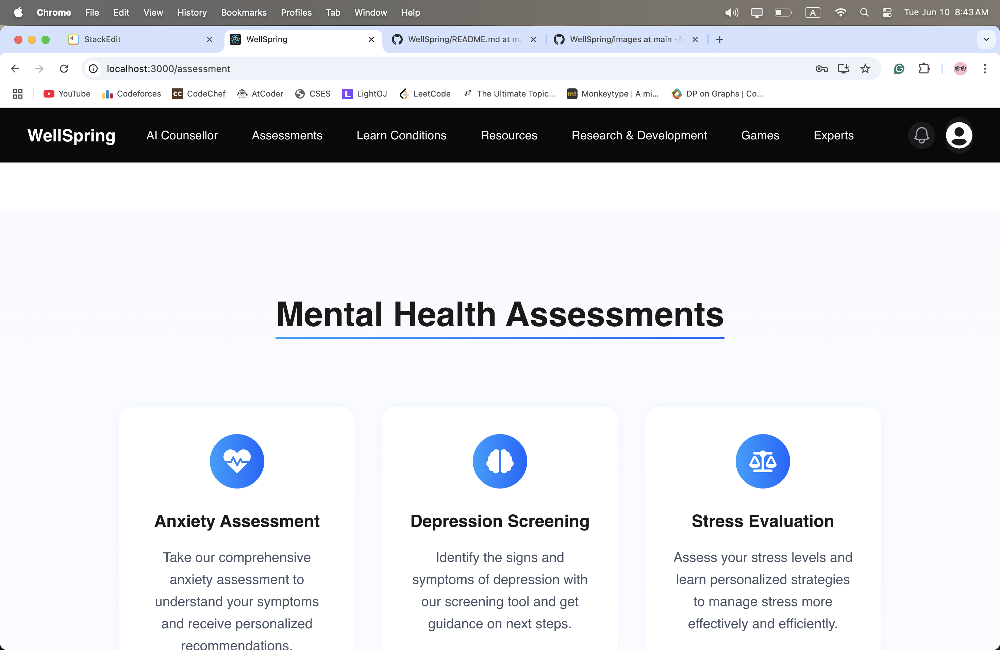
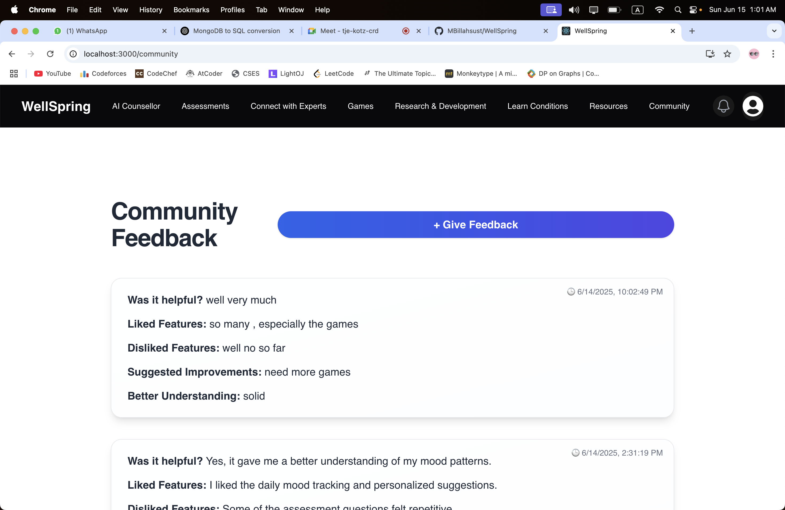

# Wellspring: (all in one  plartform for mental well being, learning and understanding mental heatlh issues)


## **Introduction**

**Wellspring** is a comprehensive mental health and wellness platform designed to empower users on their journey to better mental health. The platform offers interactive games, self-assessments, mood and activity tracking, expert counselling recommendations, and a user-friendly dashboard. With a modern, responsive UI and robust authentication, Wellspring provides a safe and engaging environment for users to understand, track, and improve their mental well-being.

---

## **Features**

**User Authentication**
Secure login, signup, and session management with JWT.

**Self-Assessments**
Scientifically-backed assessments for anxiety, depression, OCD, PTSD, and more.

**Mood & Activity Tracking**
Log daily moods and activities, visualize trends, and gain insights.

**Interactive Games**
Cognitive games like Flappy Bird to assess and improve mental skills.

**Personalized Dashboard**
View recent scores, assessment results, and progress.

**Personalized AI Counselor**
AI-driven counselling offering personalized mental health insights, coping strategies, and guidance.

**Doctor Recommendation**
Get AI-powered recommendations for mental health professionals based on your needs.
**(Powered by Lama AI)**

**Counsellor Directory**
Browse and filter a list of expert psychiatrists and counsellors.

**Feedback & Reports**
Receive detailed cognitive reports and submit feedback after games and assessments.

**Modern UI**
Responsive, accessible, and visually appealing interface with card layouts, gradients, and icons.

**Secure API Integration**
All sensitive operations are protected with JWT-based authentication.

---

# **Pages**

<br>

## Home Page





<br>

## Login Page



<br>

## Signup Page


<br>

## User Dashboard





<br>

## Flappy Bird Game


<br>

## Game Result Modal


<br>

## Mood Tracking


<br>

## Activity Logging


<br>

## Assessments (Anxiety, Depression, OCD, PTSD, etc.)



<br>

## AI Counsellor Page


<br>

## Connect With Expert Page


<br>

## Doctor Recommendation Modal


<br>

## Community/Forum Page



<br>

---


## Technologies Used  

### Frontend  
-  **HTML**: To structure the web content.
-  **CSS**: For styling the web project.
-  **React.js**: For building the user interface of the platform.
-  **React Router**: For declarative routing in React applications.
-  **Tailwind CSS**: A utility-first CSS framework for designing responsive and modern UI components.  

-  **Framer Motion**: For smooth and interactive animations.

### Backend  

-  **Node.js**: To handle server-side logic and API integration.  
-  **Express.js**: For creating and managing backend services and APIs.  
-  **JSON Web Token (JWT)**: To secure user authentication and authorization.  
-  **Axios**: For making HTTP requests from the frontend to the backend.

-  **Lama AI**: Powers intelligent doctor recommendations and cognitive insights.


### Database  

-  **MongoDB**: A NoSQL database for managing user, assessment, and doctor data.  

<br>
<br>


# 🚀 Installation

Clone the repository:

```bash
git clone <repo link>
cd WellSpring
```

## 🖥️ Frontend Setup

```bash
cd Frontend
npm install
npm start
```

## 🔧 Backend Setup

```bash
cd Backend
npm install
npm start
```


<br>
<br>


---

# Project Structure

## Root
```
WellSpring/
├── Backend/
├── Frontend/
```

---

## Backend Structure

```
Backend/
├── controller/                # Business logic for each resource
│   ├── AiCounselorController.js
│   ├── CommunityController.js
│   ├── doctorController.js
│   ├── moodAndActivityController.js
│   ├── gameController.js
│   ├── userController.js
│   ├── researchController.js
│   └── assesmentController.js
├── model/                     # Mongoose schemas/models
│   └── models.js
├── routes/                    # API route definitions
│   └── router.js
├── middlewares/               # Express middlewares (auth, error, etc.)
├── prisma/                    # Prisma ORM (Postgres) schema and migrations
│   ├── schema.prisma
│   └── migrations/
├── src/                       # (May contain additional Express app logic)
│   └── app.js
│   └── routes/
├── db.js                      # Database connection setup
├── index.js                   # Main server entry point
├── package.json
└── package-lock.json
```

## Frontend Structure

```
Frontend/
├── src/
│   ├── Components/            # Reusable UI components (Navbar, Charts, etc.)
│   ├── pages/
│   │   ├── AssessmentPages/   # All assessment flows (Anxiety, Depression, etc.)
│   │   ├── CommunityPages/    # Community, GiveFeedback, Counsellor, etc.
│   │   ├── FooterPages/       # Footer, Terms, Privacy
│   │   ├── HeaderPages/       # Header, Login, Signup, Resources, About, etc.
│   │   ├── GamesPages/        # Game UIs (FlappyBird, MemoryMatch, etc.)
│   │   ├── KeyFeaturePages/   # MoodTracking, ActivityLogging, etc.
│   │   ├── ConditionPages/    # Info pages for conditions (Anxiety, Depression, etc.)
│   │   └── UserDashboard.js   # Main dashboard
│   ├── Allcss/                # CSS files for various pages
│   ├── App.js                 # Main React app entry
│   ├── App.css
│   ├── index.js
│   ├── index.css
│   ├── UserContext.js         # React context for user/session
│   ├── IndexPage.js           # Main landing page
│   └── toastify-custom.css
├── public/                    # Static assets
├── package.json
├── package-lock.json
├── tailwind.config.js
├── postcss.config.js
└── README.md
```


# Database schema


# Functional Requirements:

1. Mental health assesments (various)
2. On time Mood tracking. 
3. Daily Activity Log in. ( what type of activity doing, making a log of this)
4. Account for registered user.
5. User dashboard along with the records of mental health assments, daily log activity and Mood tracking records. and finally Created daily routine using AI counselor help (explained below)
6. AI powered counselor (with trained on localized dataset (specially bangladeshi educated young generation and their sentiments)
7. AI counselor chatting with the mental health asssements results (any particular test, or one or two tests combined or all tests result), taken previously that are stored in the logged in users dashboard. 
8. Voice chatting with the counselor.
9. Including mood and activity tracking data in the chat (counseling too).
10. Creating a routine that would prevent mental health issue also while considering daily activity and other stuff that would maximuzize productivity.
11. Learn more about Mental health issues, (resourses are given)
12. Resources (artical, youtube videos)
13. Connect with Experts ( nearby doctors list filtering for particular mental heatlth usues).

14. Entertaintemnt selection for mood refreshment (such as movie recommandation based on mood and stress level and daily routine and work pressure) .

15. Research and developement (Using the system to collect research data on this field for mental health).


16. Mental health accelerating games selection (such as flippy bird, obsessive and repeatitive, puzzle matching, memory match, brain teasers) and a feedback system to collect data based games performance (to determine patients, focus, concentration, perseverance, other stuff of a person while doing an acitivity).  

17. Take feedback of the system from user to determine the feasibility of the system in each aspect. 


# Non functional requrements:

1. Prompt engineering (using preamble instruction) to adjust AI counselor , so that it gives response according to (localized data perspective) while also not vioulating any medical guidlines.
2. For each user account keep all of its data stored in dataset, such as assememnts results, mood tracking results, reasearch and developing reserch, routine etc. 
3. Do prompt engeneering, in such way so that particular data that was marked is included in the chant instructions.

4. So far, try best to make the project in O(n) complexity


**The perfect way to use the system, is to use it for around 3-7 days. Regularly store mood tracking data, activity login, and take some assements. Also I have time play games and store game based data (focus, attention, frustation patients and other stuff. This way the AI counselor will have perfect amount of data on the user to work on and determine from the persons data that what could cause mental health, if have one or more**


# Type of users:

**Un registered Users** 
1. Can take assmements and get immidiate results, how ever cannot store anything.
2. Can play games, but cannot take participate in the game based survey
3. Visit resources, connect with experts page.
4. Participate in Research and Developement (using gmail only, not logged in or regester)


**Registered Users**

1. Can do everything and use everything.
2. Cannot modify dataset or admin level access.


**Admin**
1. Can view research dataset.
2. Can view feedback of the system. 
3. Can view number of users.
4. Cannot breake any ethiccs (such as viewing users mental health data and chat history)


